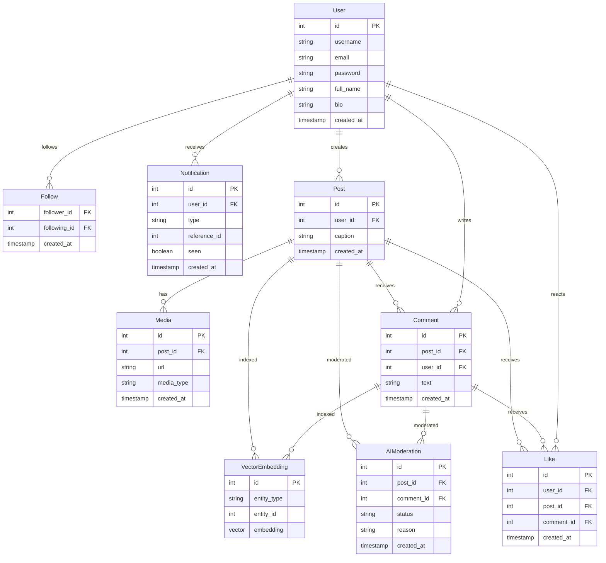

### Preview the diagram

* Open your Markdown file.
* Press Cmd+Shift+V to open the Markdown preview. You should see the rendered Mermaid diagram.
* You can also use the command palette (Cmd+Shift+P) and search for "Markdown: Open Preview to the Side".

