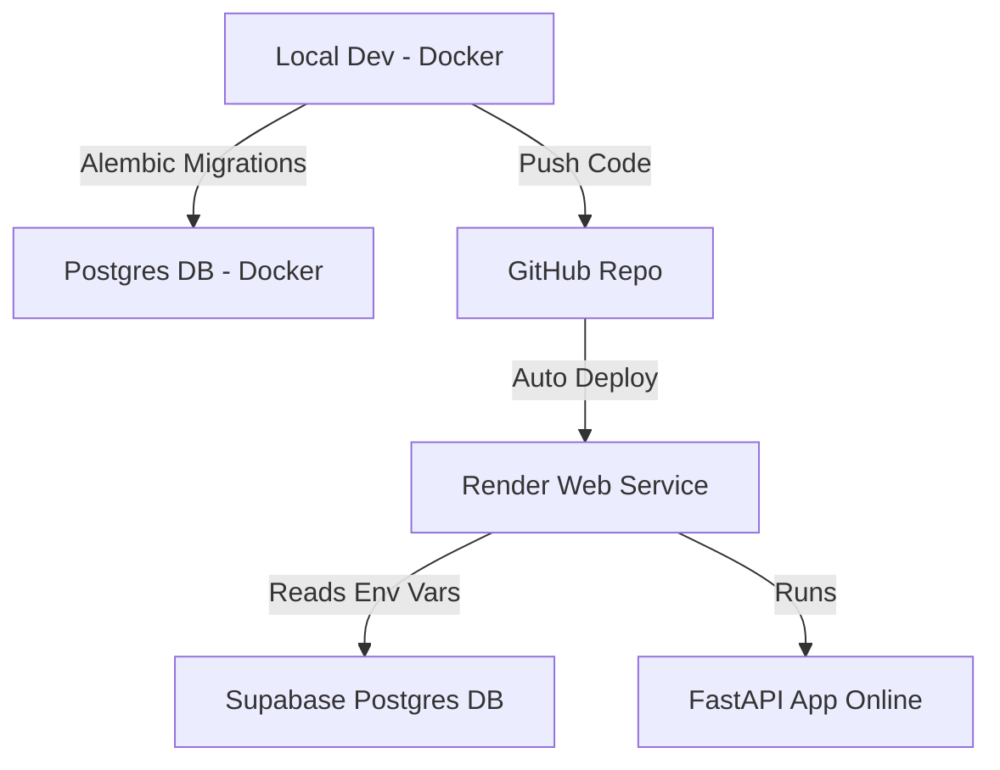

# Instagram FastAPI Backend 

A **social media style application** built using **FastAPI** with **Postgres** + **Docker** for local development, and deployed on **Render** (backend) with **Supabase** (database).  

---

## ⚡ Features  
- User authentication with JWT  
- Database migrations with Alembic  
- Dockerized development environment   

---

## 🛠️ Local Development (with Docker)  

### **1. Clone the repository**
```bash
git clone https://github.com/Arshu45/Instagram_fastapi.git
cd instagram_fastapi
````

### **2. Start Docker containers**

```bash
docker compose up --build
```

This will start:

* **FastAPI app** → [http://localhost:8000](http://localhost:8000)
* **Postgres DB** → running inside Docker on port `5433`

### **3. Connect to the database**

Use **pgAdmin** or **psql** with these credentials:

* **Host:** `localhost`
* **Port:** `5433`
* **Database:** `instagram_fastapi_db`
* **Username:** `postgres`
* **Password:** `mlt...ru`

### **4. Verify the app**

Open browser:
👉 [http://localhost:8000](http://localhost:8000)

---

## Database Migrations (Alembic)

Keep your schema in sync with your models.

### **1. Create a new migration**

```bash
docker compose exec fastapi alembic revision --autogenerate -m "your message"
```

### **2. Apply migrations**

```bash
docker compose exec fastapi alembic upgrade head
```

This ensures your local database schema matches your models.

---

## Production Deployment

### **Live App:**

🔗 [https://instagram-fastapi.onrender.com/](https://instagram-fastapi.onrender.com/)

---

### **Step 1: Deploy Web Service on Render**

1. Go to **Render → New → Web Service**
2. Connect GitHub → Select repo `instagram_fastapi`
3. Configure:

* **Name:** `instagram_fastapi`
* **Region:** Singapore (or nearest)
* **Branch:** `main`
* **Environment:** Python
* **Instance Type:** Free

**Build Command:**

```bash
pip install -r requirements.txt
```

**Start Command:**

```bash
alembic upgrade head && uvicorn app.main:app --host 0.0.0.0 --port $PORT
```

✅ Enable **Auto Deploy** (recommended)
➡️ Click **Create Web Service**

---

### **Step 2: Setup Postgres Database**

#### **Option A: Render Postgres (Free Trial — expires)**

1. In Render dashboard → **New → PostgreSQL**
2. Choose **Free Plan** → Name it (e.g., `fastapi-db`)
3. Copy connection details
4. Add them in **Render → Environment tab** of your service

#### **Option B: Supabase (Recommended Free Tier — permanent)**

1. Create a project → [Supabase Dashboard](https://supabase.com)
2. Get Postgres connection string (Settings → Database)
3. Add credentials to **Render → Environment tab**
   (replace your local DB `.env` values with Supabase ones)

---

### **Step 3: Deployment Flow**

* Push code → GitHub → **Render auto-deploys**
* During deploy:

  1. Install dependencies
  2. Run Alembic migrations (`alembic upgrade head`)
  3. Start FastAPI with Uvicorn

✅ No manual restart needed
✅ Secrets (DB creds, JWT keys) stored in **Render Environment variables**

---

## 📎 Useful Links

* **Supabase Project**: [https://supabase.com/dashboard/project/cdxtcxttrwqbmrkzxjvy/database/schemas](https://supabase.com/dashboard/project/cdxtcxttrwqbmrkzxjvy/database/schemas)
* **Render Dashboard**: [https://dashboard.render.com/web/srv-d2l386re5dus738ebrv0](https://dashboard.render.com/web/srv-d2l386re5dus738ebrv0)
* **Live App**: [https://instagram-fastapi.onrender.com/](https://instagram-fastapi.onrender.com/)

---

## ✅ Workflow Summary



---

## 🔑 Quick Commands

### Local Dev

```bash
docker compose up --build
```

### Create migration

```bash
docker compose exec fastapi alembic revision --autogenerate -m "msg"
```

### Apply migration

```bash
docker compose exec fastapi alembic upgrade head
```

### Stop containers

```bash
docker compose down
```

* YT Link : https://www.youtube.com/watch?v=0sOvCWFmrtA


